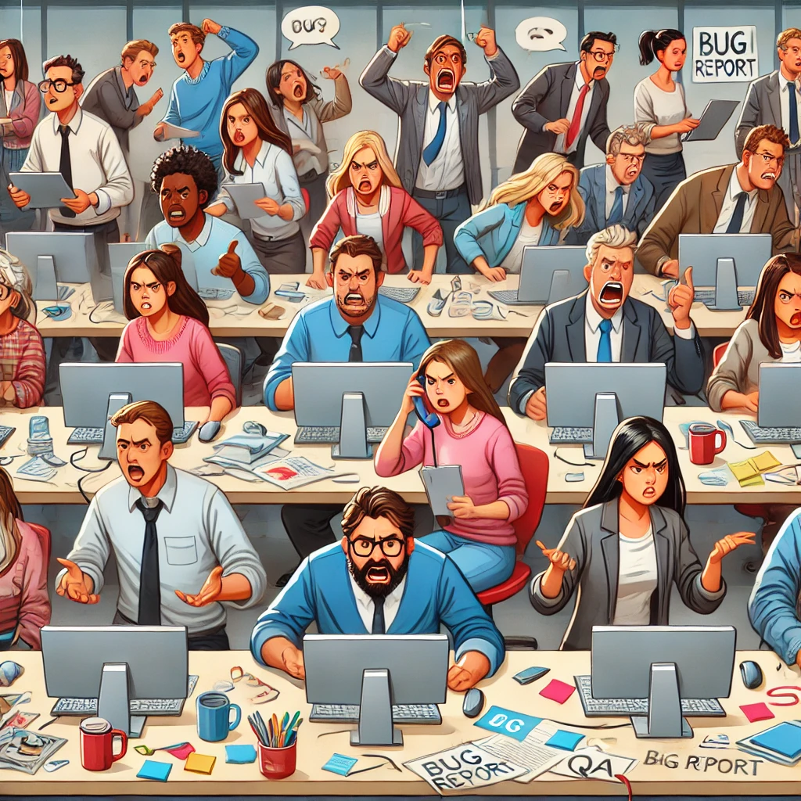

---
# You can also start simply with 'default'
theme: default
# random image from a curated Unsplash collection by Anthony
# like them? see https://unsplash.com/collections/94734566/slidev
background: cover.jpg
title: Change Data Capture
# apply unocss classes to the current slide
class: text-center
# https://sli.dev/features/drawing
drawings:
  persist: false
# slide transition: https://sli.dev/guide/animations.html#slide-transitions
transition: slide-left
# enable MDC Syntax: https://sli.dev/features/mdc
mdc: true
# take snapshot for each slide in the overview
overviewSnapshots: true
---

# Change Data Capture

<!--
The last comment block of each slide will be treated as slide notes. It will be visible and editable in Presenter Mode along with the slide. [Read more in the docs](https://sli.dev/guide/syntax.html#notes)
-->

---
transition: fade-out
layout: center
---

<Excalidraw
drawFilePath="./application.excalidraw"
:darkMode="true"
:background="false"
/>

---
transition: fade-out
layout: center
---

<Excalidraw
drawFilePath="./cdc-dual-write.excalidraw"
:darkMode="true"
:background="false"
/>

---
transition: fade-out
layout: center
---

---
transition: fade-out
layout: center
---

---
transition: fade-out
---
# Issues with Dual Writes

<v-clicks>

- Database transaction successful - write to ES failed
- Database transaction rolled back - write to ES succeeded

</v-clicks>

---
layout: image
image: /race-conditions.png
backgroundSize: 20em 70%
---
### Race conditions 😱

  Source: <a href="https://martin.kleppmann.com/2015/05/27/logs-for-data-infrastructure.html">Martin Kleppmann</a>

---
transition: fade-out
layout: center
---

<Excalidraw
drawFilePath="./cdc-dual-write-crossed.excalidraw"
:darkMode="true"
:background="false"
/>

---
transition: fade-out
layout: center
---

    Friends Don’t Let Friends Do Dual-Writes

  Gunnar Morling - 97 Things Every Data Engineer Should Know

---
transition: fade-out
---
# Alternatives

<v-clicks depth="2">

- Distributed transaction
  - Lack of support (Elasticsearch, Kafka,...)
  - Slow
  - Additional component/single point of failure

</v-clicks>

---
transition: fade-out
---
# Debezium

<v-clicks>

- Open source change data capture platform
- Uses Kafka for event storage/distribution

</v-clicks>

---
transition: fade-out
---
# Basic idea

<v-clicks>

- Parse transaction log
- Publish events to a message broker (Kafka)

</v-clicks>

---
layout: image
image: /architecture.png
backgroundSize: 30em 30%
---
# Architecture

  Source: <a href="https://debezium.io/documentation/reference/3.1/architecture.html">Debezium.io</a>

---
transition: fade-out
layout: center
---

    💻 Demo 💻

---
transition: fade-out
---
# Summary

### Advantages

 
<v-clicks>

- Robustness
- Scalability
- No modification of application code needed

</v-clicks>

---
transition: fade-out
---
# Summary

### Disadvantages 

 
<v-clicks>

- Complexity
- More components to maintain
- Another tool to learn

</v-clicks>

